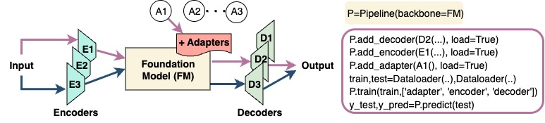

# FMTK: A Modular Toolkit for Composable Time Series Foundation Model Pipelines

## Overview
Foundation models (FMs) have opened new avenues for machine learning applications due to their ability to adapt to new and unseen tasks with minimal or no further training. Time-series foundation models (TSFMs)---FMs trained on time-series data---have shown strong performance on classification, regression, and imputation tasks. Recent pipelines combine TSFMs with task-specific encoders, decoders, and adapters to improve performance; however, assembling such pipelines typically requires ad hoc, model-specific implementations that hinder modularity and reproducibility. We introduce FMTK, an open-source, lightweight and extensible toolkit for constructing and fine-tuning TSFM pipelines via standardized backbone and component abstractions. FMTK enables flexible composition across models and tasks, achieving correctness and performance with an average of seven lines of code.



### Code Map
```
fmtk/
├── pipeline.py             # Main pipeline implementation
├── metrics.py              # Evaluation metrics
├── utils.py                # Evaluation metrics
├── logger.py               # Memory, Energy logger
├── datasets/
│   └── ecg5000.py          # ECG5000 dataset implementation
│   └── ... 
├── components/
│   ├── backbones/
│   │   └── chronos.py      # Chronos foundation model
│   │   └── ...            
│   ├── encoders/
│   │   └── ...             # Encoders
│   └── decoders/
│       ├── classification/  
│       │   └── ...         # Classification decoders
│       ├── regression/
│       │   └── ...         # Regression decoders
│       └── forecasting/
│           └── ...         # Forecasting decoders
```

## Installation
Clone the repo
```
cd FMTK
conda create -n fmtk python=3.10
conda activate fmtk
pip install -e .
```
For working with PPG-BP data related tasks install
```
pip install pyPPG==1.0.41
```
Note: There might be a package conflict, but it should still function correctly.

For quick start please check out [examples](./examples).
